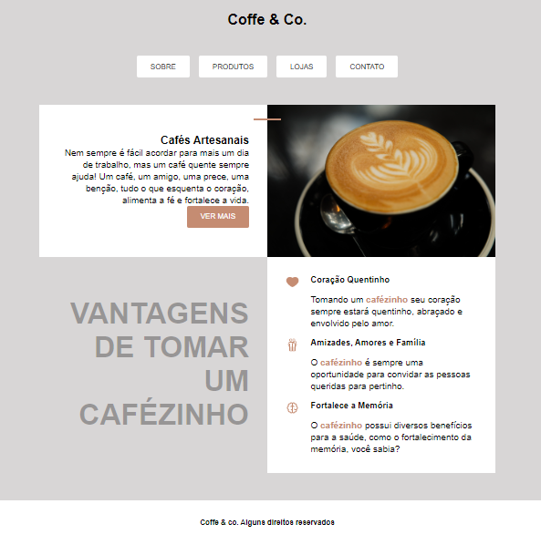

# Coffe-Co

  Página criada para estudos de HTML e CSS.  
  Conteúdos aplicados:  
  Posicionamento utilizando Grid, Flex-Box e Position. 
  Semântica no HTML utilizando tags como header, main, nav, lista desordenada (ul/li) e footer. 
  Verificação de unidades, tipografia e background. 
  Inclusão de pseudo Classes e pseudo elements.

